# Air Gifts — Documentation technique

> **Audience** : développeurs rejoignant le projet. Ce document décrit l'architecture, les écrans, les flux et les points d'extension du MVP.

---

## Démarrage rapide

```bash
npm install
npm run dev        # http://localhost:5173
npm run build      # prod → dist/
```

**Pré-requis** : Node 18+. Aucune variable d'environnement requise pour le mode démo.

---

## Architecture

```
src/
├── engine/          # Logique pure (pas de React)
│   ├── utils.js     # norm(), scramble(), caesar()
│   ├── data.js      # Dictionnaires : pays, genres, salles, clubs…
│   ├── builders.js  # buildConcert / buildLigue1 / buildFestival / buildVoyage
│   └── catalog.js   # CATALOG (134 items), findById(), search()
├── components/
│   ├── Game.jsx     # Moteur de jeu complet (stages, indices, surprises, reveal)
│   ├── Confetti.jsx # Pluie de confettis (CSS keyframe, 60 particules)
│   └── GameStyles.jsx # Keyframes globales (ag-fall, ag-shake, ag-pop, ag-glow)
├── pages/
│   ├── CataloguePage.jsx  # Route "/" — banc de test 134 événements
│   └── GiftPage.jsx       # Route "/g/:token" — expérience gifté
├── App.jsx          # React Router
├── main.jsx         # Entrée Vite
└── index.css        # @tailwind base/components/utilities
demos/               # Composants autonomes d'origine (référence)
```

**Stack** : Vite 5 · React 18 · React Router 6 · Tailwind CSS 3

---

## Écrans

### 1. Catalogue (`/`)

Banc de test : 135 événements, filtres par catégorie, recherche normalisée (accents/casse ignorés).

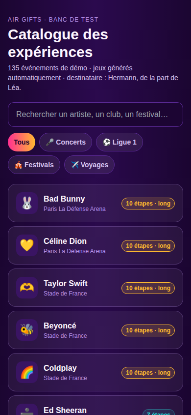

Chaque carte affiche : emoji, nom, lieu, et le nombre d'étapes + badge "long" si le jeu comporte 10+ étapes.

---

### 2. Catalogue — filtre Concerts

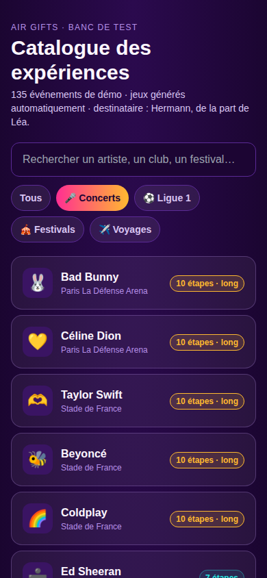

Filtres disponibles : Tous / 🎤 Concerts / ⚽ Ligue 1 / 🎪 Festivals / ✈️ Voyages.  
Le filtre actif est mis en gradient rose→orange ; les inactifs en fond semi-transparent avec bordure violette.

---

### 3. Catalogue — recherche

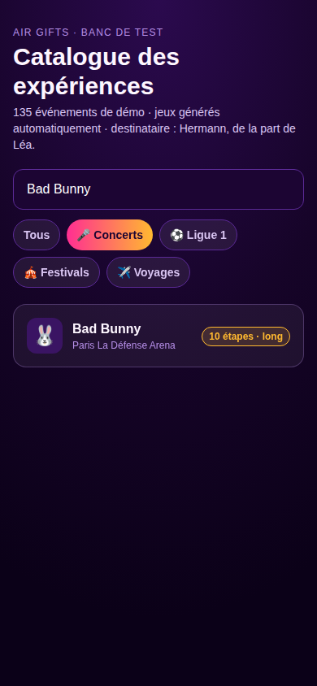

La recherche utilise `norm()` (suppression accents + minuscule) sur `name + place` — "céline dion", "celine dion", "CELINE DION" donnent le même résultat.

---

### 4. Intro du jeu

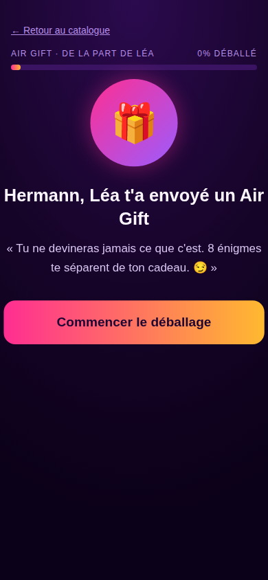

Affiché avant la première énigme : destinataire, expéditeur, nombre d'étapes, message d'accroche. Barre de progression à 0%.

---

### 5. Énigme en cours

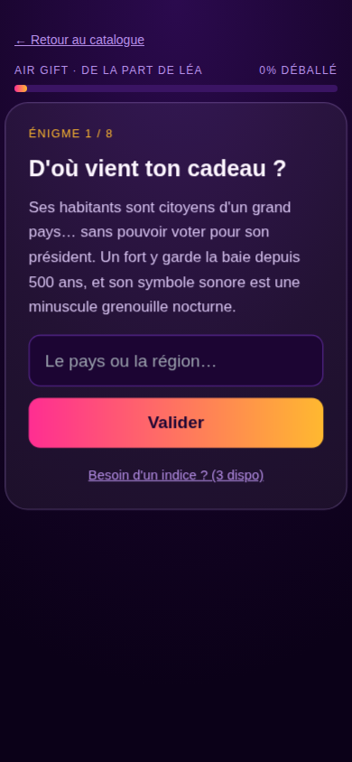

Chaque stage affiche :
- Badge `Énigme N / TOTAL`
- Titre + texte de l'énigme
- Champ de saisie (mode `text` ou `numeric` selon `isCode`)
- Bouton **Valider** (ou appuyer sur Entrée)
- Lien "Besoin d'un indice ?" (N disponibles)

---

### 6. Indices progressifs

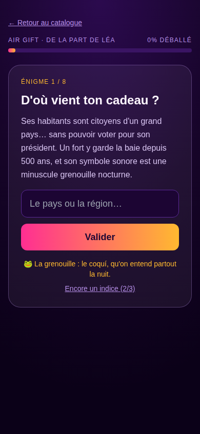

Les indices se dévoilent un par un. Le lien passe de "Besoin d'un indice ? (3 dispo)" à "Encore un indice (2/3)" etc. Les indices déjà révélés restent visibles.

---

### 7. Interstitiel "Surprise"

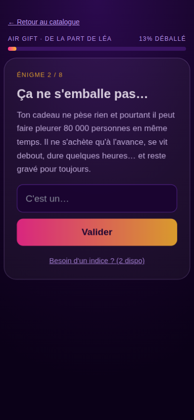

Après certaines étapes, un popup surprise apparaît avant de passer à l'étape suivante. Il peut contenir :
- Une **fausse piste** (« C'est un CD ! Mais non, je rigole… »)
- Un **indice bonus** avec l'emoji de l'événement

Implémenté via `stage.surprise = { emoji, title, text, button }` dans les builders.

---

### 8. Étape finale — code de déverrouillage

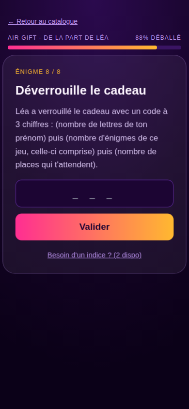

La dernière étape est toujours un code numérique à 3 chiffres :  
`(nb lettres du prénom du destinataire)(nb total d'étapes)(nb de places = 2)`  
→ Pour Hermann, 8 étapes : **782**

Le champ passe en mode `inputMode="numeric"` avec espacement large.

---

### 9. Sceau qui se brise

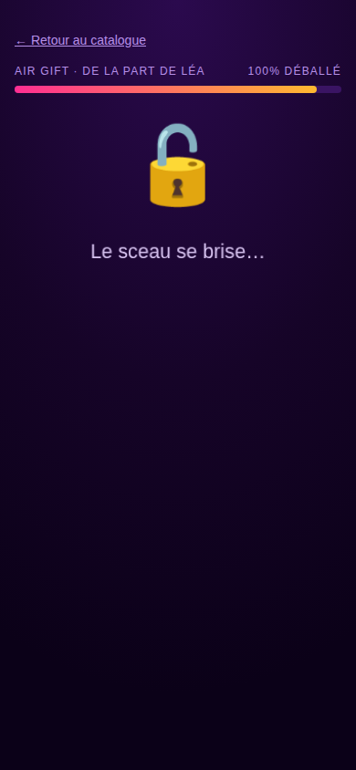

Transition de 900 ms après le code correct : cadenas ouvert, "Le sceau se brise…", barre à 100%.

---

### 10. Révélation finale + confettis

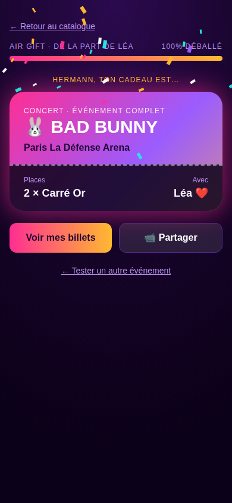

La carte-billet affiche :
- Surtitre (type d'événement)
- Nom en grand + emoji
- Lieu/salle
- Nombre de places + prénom de l'offreur
- Boutons **Voir mes billets** et **📹 Partager**

Les confettis sont 60 rectangles animés CSS en rose/orange/cyan/violet/blanc.

---

### 11. Route cadeau `/g/:token`

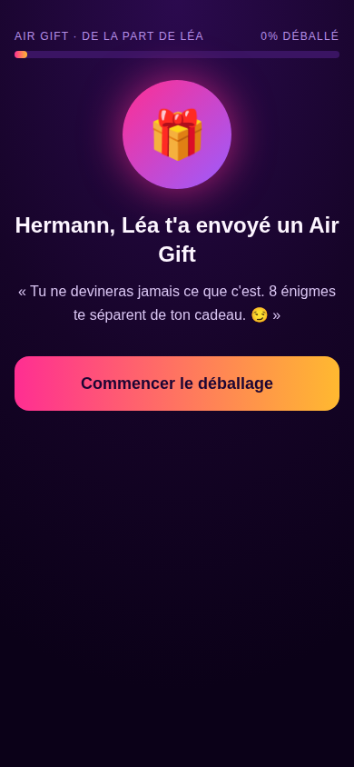

L'intro est identique à celle du catalogue, mais sans le bouton "← Retour au catalogue".  
En production, le token est résolu côté serveur ; en mode démo, il est mappé statiquement dans `GiftPage.jsx`.

**Fixtures démo disponibles** :

| URL | Événement | Destinataire |
|---|---|---|
| `/g/demo-bad-bunny` | 🐰 Bad Bunny — Paris La Défense Arena | Hermann / Léa |
| `/g/demo-celine` | 💛 Céline Dion — Paris La Défense Arena | Marie / Thomas |
| `/g/demo-psg-om` | ⚽ PSG – OM — Parc des Princes | Alexandre / Sophie |
| `/g/demo-hellfest` | 🤘 Hellfest — Clisson | Hugo / Emma |
| `/g/demo-rome` | 🏛️ Rome — City-trip Italie | Chloé / Pierre |

---

### 12. Token invalide (404)

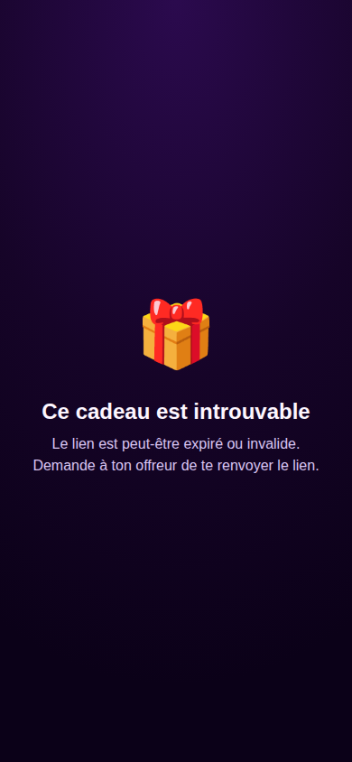

Si le token n'est pas trouvé : écran d'erreur simple avec message d'aide. Pas de redirection agressive.

---

### 13. Catalogue — Voyages

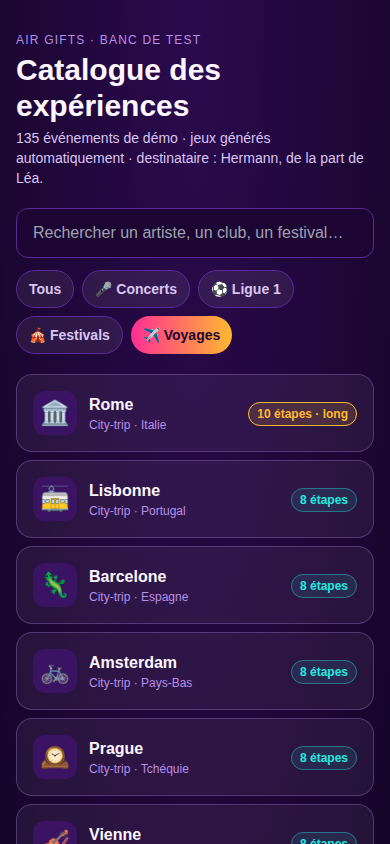

28 destinations : city-trips européens (Rome, Lisbonne, Prague, Vienne, Budapest…) et week-ends nature France (Verdon, Luberon, Pays Basque, Mont-Saint-Michel…).

---

### 14. Catalogue — Ligue 1

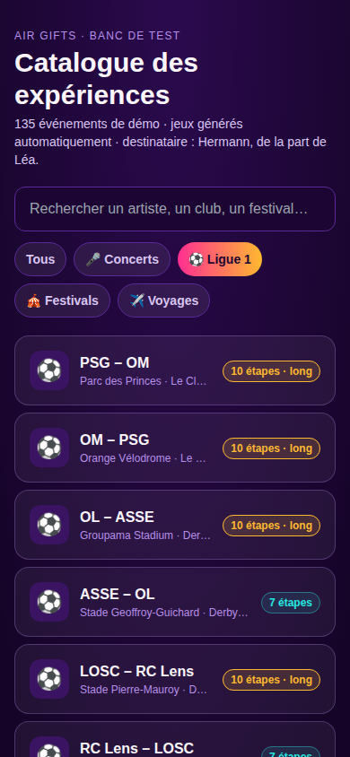

20 matchs : derbies prioritaires (Le Classique, Derby rhodanien, Derby du Nord…) avec badge "long" sur les affiches premium (7–10 étapes).

---

## Moteur de jeu — structure d'un stage

```js
{
  title: "D'où vient ton cadeau ?",          // titre affiché
  text: "Ses habitants sont citoyens…",       // énigme
  ph: "Le pays ou la région…",               // placeholder input
  a: ["puertorico", "portorico"],             // réponses acceptées (normalisées)
  hs: ["🐸 La grenouille…", "🏰 Le fort…"],  // indices (dévoilés un par un)
  scramble?: "YBD UBYN",                     // affichage anagramme (tiles)
  isCode?: true,                             // active le mode numérique
  surprise?: { emoji, title, text, button }, // popup interstitiel
}
```

### Normalisation des réponses

```js
// src/engine/utils.js
export const norm = (s) =>
  s.toLowerCase()
   .normalize("NFD")
   .replace(/[̀-ͯ]/g, "")   // supprime diacritiques
   .replace(/[^a-z0-9]/g, "");        // supprime espaces et ponctuation
```

`"Porto Rico"` → `"portorico"` ✓ · `"Réggaetón"` → `"reggaeton"` ✓

### Builders disponibles

| Fonction | Entrée | Étapes générées |
|---|---|---|
| `buildConcert(ev, recipient, sender)` | `[name, country, genre, venue, emoji, isLong]` | 6–10 |
| `buildLigue1(fx, recipient, sender)` | `[homeKey, awayKey, label, isLong]` | 6–8 |
| `buildFestival(f, recipient, sender)` | `[name, genre, emoji, cityText, cityAnswers, cityHints, lieu]` | 6 |
| `buildVoyage(vg, recipient, sender)` | `[name, kind, country, emoji, destText, destAnswers, destHints, sub, isLong]` | 6–8 |

Chaque builder retourne `{ stages: Stage[], ticket: { sur, big, sub, emoji } }`.

---

## Ajouter un événement au catalogue

1. Ajouter l'entrée dans le tableau correspondant dans `src/engine/data.js` :
   - Concert → `CONCERTS` : `["Nom", "pays", "genre", "venue", "emoji", 0|1]`
   - Ligue 1 → `FIXTURES` : `["clubDomicile", "clubExterieur", "labelDerby", 0|1]`
   - Festival → `FESTIVALS` : `[nom, genre, emoji, texteVille, réponsesVille, indicesVille, lieu]`
   - Voyage → `VOYAGES` : `[nom, "ville"|"nature", pays, emoji, texte, réponses, indices, sousTitre, 0|1]`

2. Si le pays/genre/salle/club n'existe pas encore, ajouter le dictionnaire dans `data.js`.

3. `npm run dev` → le catalogue se recharge, le nouveau jeu est jouable immédiatement.

---

## Ajouter une fixture de démo (`/g/:token`)

Dans `src/pages/GiftPage.jsx`, ajouter une entrée dans `DEMO_FIXTURES` :

```js
"mon-token": { catalogId: "c5", recipient: "Prénom", sender: "Expéditeur" },
```

`catalogId` correspond aux IDs générés dans `catalog.js` : `c0`–`c73` (concerts), `l0`–`l19` (Ligue 1), `f0`–`f13` (festivals), `v0`–`v27` (voyages).

---

## Feuille de route (issues GitHub)

| # | Titre | Label |
|---|---|---|
| [#1](../../issues/1) | Landing page de validation marché | `growth` |
| [#2](../../issues/2) | MVP web app gifté (zéro installation) | `mvp` |
| [#3](../../issues/3) | Flow offreur : création d'expérience | `mvp` |
| [#4](../../issues/4) | Génération LLM des énigmes (API Anthropic) | `mvp` |
| [#5](../../issues/5) | Backend : scellement du cadeau + modèle de données | `backend` |
| [#6](../../issues/6) | Système de QR codes vierges activables (retail) | `backend` |
| [#7](../../issues/7) | Analytics du jeu | `backend` |
| [#8](../../issues/8) | i18n et lancement multi-pays | `phase-2` |
| [#9](../../issues/9) | Catalogue événements via API billetterie | `phase-2` |
| [#10](../../issues/10) | Hardware : cadenas universel (phase 2) | `phase-2` |
